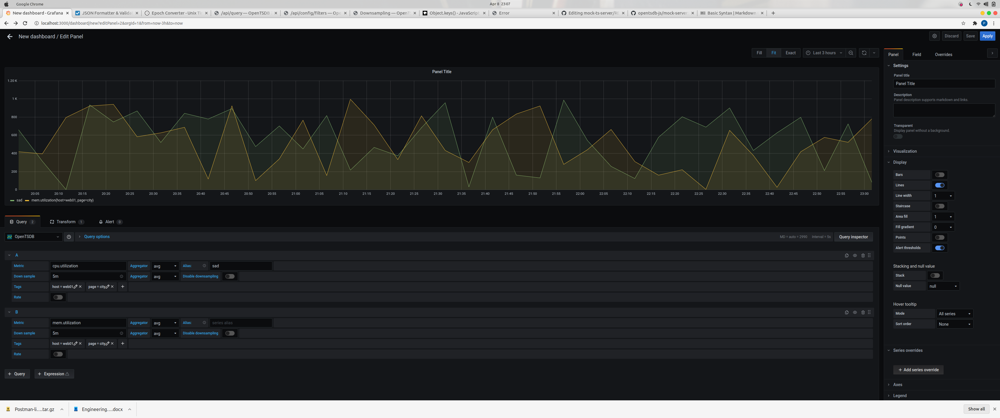

# Mock TS DB Server

This is robbed from https://github.com/opentsdb-js/mock-server as a base. I forgot to fork it properly, will fix later. Anyway, just an example of how we can plug Grafana into our own API, as long as it *looks* like the OpenTSDB format. 

## Instructions:

1. Download and have the Grafana service running

- *brew install grafana*
- *brew start grafana*

- browser: http://localhost:3000
- user: admin
- pass: admin

2. Run the mock server

- from root directory: *node ./examples/index.js*

3. Add Datasource (from the settings icon) 
4. Select openTSB and fill in the URL of *http://localhost:4242*
5. Click on Add new Dashboard (first icon)

The mock server will generate random data for each call. It will base the data on *start*, *end* and for now tags aren't really supported; the tags sent will simply be returned, it's not aggregating the tags as per:

http://opentsdb.net/docs/build/html/api_http/query/index.html

